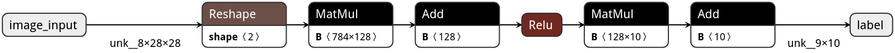
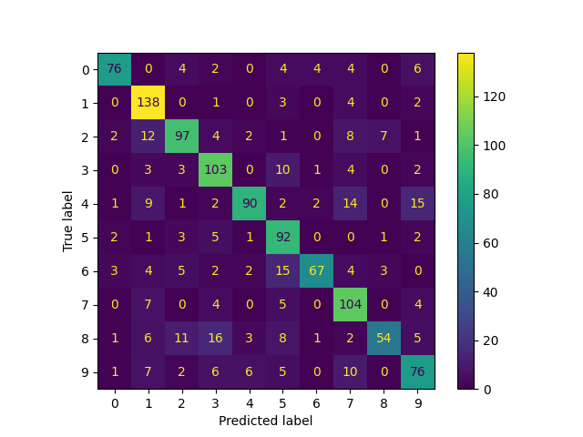

# Deploy a Model Step by Step

This tutorial shows how to deploy a model with the [my Toolkit](../Tools/model_builder.py) and run benchmark using SD Card.

Note: For a model quantized on other platforms:
- If the quantization scheme (e.g. TFLite int8 model) is different from that of ESP-DL then the model cannot be deployed with ESP-DL.


# Preparation

# step 1: Train [MNIST](https://www.kaggle.com/datasets/hojjatk/mnist-dataset/code) model

<p align="center">
     
</p>

An example of how to train and convert your model to ONNX is [here](https://colab.research.google.com/drive/1tQ9jgIyK1tncxgtFgfb_2fyME6mJX7LU?usp=sharing).


## Step 1.1: Convert Your Model

In order to be deployed, the trained floating-point model must be converted to an integer model, the format compatible with ESP-DL. Given that ESP-DL uses a different quantization scheme and element arrangements compared with other platforms, 

## Step 1.2: Config project by [build_scripts_config.toml](./build_scripts_config.toml)

To faciliate next steps a config file is provided which is required by model_builder script.

## Step 1.3: Convert to ESP-DL Format and Quantize

The calibrator in the quantization toolkit can quantize a floating-point model to an integer model which is compatible with ESP-DL. For post-training quantization, please prepare the calibration dataset (can be the subset of training dataset or validation dataset).

Run the script with the following command in Tools directory:

```python
python model_builder.py -p <MNIST project directory>
```

And you will see the following log which includes the quantized coefficients for the model's input and output. These coefficients will be used in later steps when defining the model so enter them in order from the begining layer until the last layer seprating by ',' for example:

```python

Quantized model info:
model input name: input, exponent: 1
Reshape layer name: sequential/flatten/Reshape, output_exponent: 1
Gemm layer name: fused_gemm_0, output_exponent: 5
Gemm layer name: fused_gemm_1, output_exponent: 6
Gemm layer name: fused_gemm_2, output_exponent: 7
```

Now you will asked to enter `1,5,6,7` as desired exponents. note that you dont need to enter reshape layer exponent value.

For more information about quantization toolkit API, please refer to [Quantization Toolkit API](https://github.com/espressif/esp-dl/blob/master/tools/quantization_tool/quantization_tool_api.md).

# Step 2: Compile & Deploy project

`idf.py set-target esp32s3` or `idf.py set-target esp32`

`idf.py menuconfig` => for more configuration (optional).

`idf.py build flash monitor`


# Step 3: Run Your Model

In terminal after ESP booted enter `run_benchmark` command or enter `help` to receive more information. After the benchmark is finished, all the records are automatically copied to the sdcard as `report.txt` file so that you can extract it on a PC.


# Results
Finally, to evaluate result run [analysis script](../Tools/analysis.py) and provide actual path of record file.

<center>

| SoC      | description         | delay  | accuracy |
|----------|:-------------------:|:------:|---------:|
| ESP32    |INT8 & 2 dense layers as Conv2| 19.89 ms   | 70.41    |
| ESP32    |INT8 & 3 dense layers as Conv2| 20.55 ms   | 74.75    |
| ESP32    |INT8 & 2 dense layers as Fully connected| 20.05 ms   | 70.41    |
| ESP32    |INT8 & 3 dense layers as Fully connected| 21.06 ms   | 74.75    |
| ESP32s3    |INT8 & 2 dense layers as Fully connected| 4.03 ms   | 70.35    |
| ESP32s3    |INT8 & 3 dense layers as Fully connected| 4.15 ms   | 74.68    |
</center>

<p align="center">
     
</p>