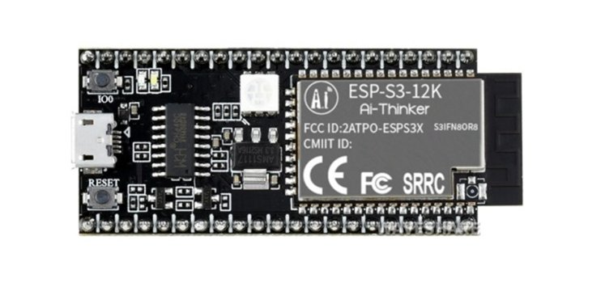
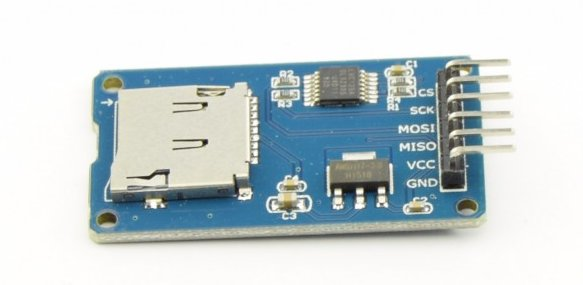

# Running Deep neural network dedicated to [Espressif SoCs](https://www.espressif.com/en/products/socs)

This repository created for experimental study for deploying Deep neural networks on Espressif SoCs and evaluating their performance.

## Overview

[Tensorflow_lite](https://www.tensorflow.org/lite) and [ESP-DL](https://github.com/espressif/esp-dl/tree/master) are two main frameworks to deploy DNN on Espressif SoCs. Projects are placed in the folders with same name as their used framework. Some tools are developed and placed in ESP-DL/Tools to facilitate some tasks like converting ONNX model to C/CPP codes ready to compile. 

## Software requirements

[ESP-IDF V4.4.x](https://github.com/espressif/esp-idf).

Python 3.8 or later.

## Instalation steps

`git clone --recursive https://github.com/Farzinkh/AI_EDGE.git`

`cd AI_EDGE`

`pip install -r requirements.txt`

## Hardwares to Utilize

### ESP32-CAM

     

[Download Schematic](https://loboris.eu/ESP32/ESP32-CAM%20Product%20Specification.pdf)

### ESP32-S3

     

[Download Schematic](https://www.waveshare.com/w/upload/6/68/Nodemcu-esp-s3-12k-kit_schematic.pdf)

With a microSD Card Adapter Module 

     

